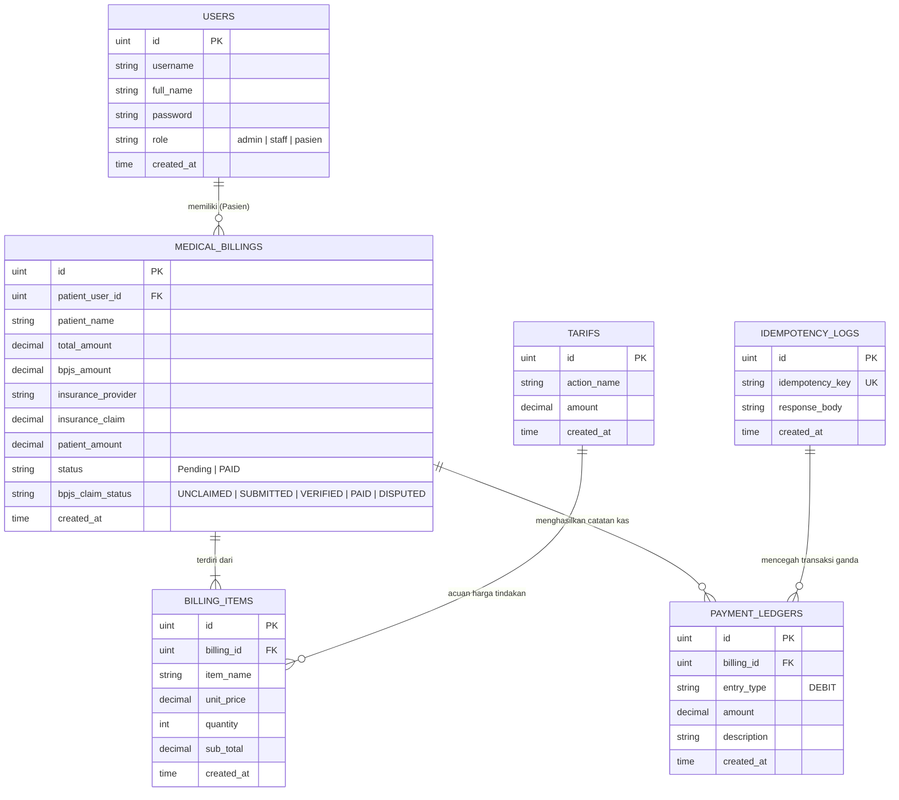

# SIMRS Billing Backend API Documentation 🏥💳

Backend REST API untuk Sistem Informasi Manajemen Rumah Sakit (SIMRS) - Modul Billing & Transaksi Pembayaran Pasien. Built using **Go (Golang)**, **Gin Web Framework**, **GORM ORM**, and **PostgreSQL**.

---

## 📋 Daftar Isi

- [Fitur Utama](#-fitur-utama)
- [Teknologi yang Digunakan](#-teknologi-yang-digunakan)
- [Struktur Proyek (Layered Architecture)](#-struktur-proyek-layered-architecture)
- [Diagram Arsitektur & ERD](#-diagram-arsitektur--erd)
- [Panduan Instalasi & Memulai](#-panduan-instalasi--memulai)
- [Seeding Database Data Awal](#-seeding-database-data-awal)
- [Dokumentasi Lengkap API Endpoint](#-dokumentasi-lengkap-api-endpoint)
  - [1. Autentikasi (Public)](#1-autentikasi-public)
  - [2. Staff / Admin Routes (Privat)](#2-staff--admin-routes-privat)
  - [3. Pasien Routes (Privat)](#3-pasien-routes-privat)
- [Idempotensi & Keamanan Keuangan](#-idempotensi--keamanan-keuangan)

---

## 🚀 Fitur Utama

1. **Role-Based Access Control (RBAC)**: Autentikasi JWT dengan hak akses terpisah untuk `admin`, `staff`, dan `pasien`.
2. **Kalkulasi Presisi Tinggi (Decimal Math)**: Menghindari *floating-point rounding error* pada perhitungan uang dengan pustaka `shopspring/decimal`.
3. **Pembayaran Idempoten (*Idempotent Payment*)**: Perlindungan transaksi ganda menggunakan header `X-Idempotency-Key` dan tabel audit `idempotency_logs`.
4. **Manajemen Klaim Penjamin Terpisah**: Pelacakan dan verifikasi piutang klaim terpisah antara **BPJS Kesehatan (V-Claim)** dan **Asuransi Swasta** (AXA Mandiri, Prudential, Allianz, Manulife, FWD, dll.) menggunakan filter `provider_type`.
5. **Prioritas Auto-Fill Identitas Pasien**: Pemilihan pasien terdaftar mengutamakan **Nama Lengkap (`full_name`)** sebelum jatuh kembali (*fallback*) ke **Username**.
6. **Flexibility Payload Item Billing**: Mendukung pembuatan tagihan dengan referensi `action_id`, `tarif_id`, maupun array `action_ids` secara bersamaan.
7. **Buku Kas / Ledger Pembayaran (*Payment Ledger*)**: Pencatatan mutasi kas masuk secara permanen (*immutable*) untuk kebutuhan audit keuangan.
8. **Pagination & Live Search**: Semua endpoint `GET` mendukung *query parameter* `page`, `limit`, `search`, dan *filter status/role/provider*.

---

## 🛠️ Teknologi yang Digunakan

* **Bahasa Pemrograman**: Go 1.26+
* **Web Framework**: [Gin Gonic](https://github.com/gin-gonic/gin)
* **ORM**: [GORM](https://gorm.io/)
* **Database**: PostgreSQL
* **Autentikasi**: JWT (`golang-jwt/jwt/v5`) & Bcrypt (`golang.org/x/crypto`)
* **Penanganan Keuangan**: `github.com/shopspring/decimal`

---

## 📂 Struktur Proyek (Layered Architecture)

Proyek ini menerapkan pola arsitektur berlapis yang rapi (*Decoupled Architecture*) untuk memudahkan pemeliharaan kode:

```text
server/
├── cmd/
│   └── seed/
│       └── main.go          # Standalone runner untuk seeding database
├── config/
│   └── db.go                # Koneksi PostgreSQL & AutoMigrate tabel
├── handlers/
│   ├── auth_handler.go      # Controller Register & Login
│   ├── billing_handler.go   # Controller Billing & Payment
│   ├── claim_handler.go     # Controller Klaim BPJS & Asuransi Swasta
│   ├── ledger_handler.go    # Controller Laporan Ledger Kas
│   ├── tarif_handler.go     # Controller Master Data Tarif
│   └── user_handler.go      # Controller Manajemen User
├── middleware/
│   └── auth.go              # Middleware Verifikasi JWT & Role Gatekeeper
├── models/
│   ├── billing_item.go      # Model Rincian Tindakan Tagihan
│   ├── idempotency_log.go   # Model Log Transaksi Idempoten
│   ├── medical_billing.go   # Model Utama Tagihan Pasien
│   ├── payment_ledger.go    # Model Jurnal Mutasi Kas
│   ├── tarif.go             # Model Master Tarif Layanan
│   └── user.go              # Model Pengguna & Role
├── route/
│   └── route.go             # Registrasi Terpusat Seluruh Endpoint API
├── seeders/
│   └── seeder.go            # Data Awal Master User & Tarif Layanan
├── services/
│   ├── analytics_service.go # Business Logic Analytics, Grafik, & Export PDF/Excel/CSV
│   ├── audit_service.go     # Business Logic Audit Trail System
│   ├── billing_service.go   # Business Logic Tagihan Medis (CRUD)
│   ├── claim_service.go     # Business Logic Klaim BPJS & Asuransi Swasta
│   ├── ledger_service.go    # Business Logic Jurnal Mutasi Kas (Ledgers)
│   ├── payment_service.go   # Business Logic Otorisasi Pembayaran & Idempotensi
│   ├── tarif_service.go     # Business Logic Master Tarif
│   └── user_service.go      # Business Logic User & Profil
├── utils/
│   ├── jwt.go               # Generator & Helper Token JWT
│   ├── pagination.go        # Kalkulator Pagination & Filter Param
│   └── password.go          # Hashing Password dengan Bcrypt
├── .env                     # File Konfigurasi Environment (Jangan di-commit)
├── go.mod                   # Dependencies Manager Go
└── main.go                  # Entrypoint Utama Server HTTP
```

---

## 📐 Diagram Arsitektur & ERD

### 1. Diagram Relasi Entitas Database (ERD)



---

## ⚡ Panduan Instalasi & Memulai

### 1. Prasyarat System
* Go versi 1.26+ terinstall
* PostgreSQL Server aktif
* Aplikasi API Client (Postman / Insomnia / cURL)

### 2. Konfigurasi Environment (`.env`)
Buat file bernama `.env` di dalam folder `server/` dengan konfigurasi berikut:

```env
DB_HOST=localhost
DB_USER=postgres
DB_PASSWORD=postgres
DB_NAME=simrs_billing
DB_PORT=5432
JWT_SECRET=supersecretkey_simrs_2026
PORT=8080
```

### 3. Install Dependensi
```bash
go mod download
```

### 4. Jalankan Server
```bash
go run main.go
```
Server akan berjalan di `http://localhost:8080`.

---

## 🌱 Seeding Database Data Awal

Untuk mengisi data awal (*User Admin, Staff, Pasien, dan Master Tarif Layanan SIMRS*), Anda dapat memilih salah satu cara berikut:

### Cara 1: Menjalankan Server Sekaligus Seeding
```bash
go run main.go -seed
```

### Cara 2: Menjalankan File Seeder Saja
```bash
go run cmd/seed/main.go
```

### Data Awal Default:
* **Admin**: `admin` / `password123` (ID: 1)
* **Staff**: `staff` / `password123` (ID: 2)
* **Pasien 1**: `pasien1` / `password123` (ID: 3)
* **Pasien 2**: `pasien2` / `password123` (ID: 4)

---

## 📚 Dokumentasi Lengkap API Endpoint

Base URL: `http://localhost:8080/api/v1`

---

### 1. Autentikasi (Public)

#### A. Registrasi Pengguna Baru
* **Endpoint**: `POST /auth/register`
* **Request Body**:
  ```json
  {
    "username": "pasien3",
    "password": "password123",
    "role": "pasien"
  }
  ```
* **Response (201 Created)**:
  ```json
  {
    "message": "Registrasi Berhasil",
    "role": "pasien"
  }
  ```

#### B. Login & Dapatkan Token JWT
* **Endpoint**: `POST /auth/login`
* **Request Body**:
  ```json
  {
    "username": "staff",
    "password": "password123"
  }
  ```
* **Response (200 OK)**:
  ```json
  {
    "message": "Login Berhasil",
    "role": "staff",
    "token": "eyJhbGciOiJIUzI1NiIsInR5cCI6IkpXVCJ9..."
  }
  ```

---

### 2. Staff / Admin Routes (Privat)
> **Header Wajib**: `Authorization: Bearer <token_staff_atau_admin>`

#### A. Master Data Tarif Layanan
| Method | Endpoint | Query Param / Path | Deskripsi |
| :--- | :--- | :--- | :--- |
| `POST` | `/tarifs` | — | Tambah tarif tindakan medis baru |
| `GET` | `/tarifs` | `page=1&limit=10&search=Dokter` | Get list tarif (paginated & search) |
| `GET` | `/tarifs/:id` | `id` (uint) | Get detail tarif by ID |
| `PUT` | `/tarifs/:id` | `id` (uint) | Update tarif by ID |
| `DELETE` | `/tarifs/:id` | `id` (uint) | Hapus tarif by ID |

##### Contoh Request Body `POST /tarifs`:
```json
{
  "action_name": "Pemeriksaan USG Abdomen",
  "amount": 250000
}
```

---

#### B. Tagihan Medis (*Medical Billing*)
| Method | Endpoint | Query Param / Path | Deskripsi |
| :--- | :--- | :--- | :--- |
| `POST` | `/billings` | — | Buat tagihan baru pasien |
| `GET` | `/billings` | `page=1&limit=10&search=pasien1&status=Pending` | Get list seluruh tagihan |
| `GET` | `/billings/:id` | `id` (uint) | Get detail tagihan beserta rincian tindakan |
| `PUT` | `/billings/:id` | `id` (uint) | Update tagihan (nama/status/klaim penjamin) |
| `DELETE` | `/billings/:id` | `id` (uint) | Hapus tagihan |
| `POST` | `/billings/:id/pay` | `id` (uint) | Proses pembayaran tagihan |

##### Contoh Request Body `POST /billings`:
```json
{
  "patient_user_id": 6,
  "patient_name": "Lesmana Adhi Kusuma",
  "insurance_provider": "AXA Mandiri",
  "insurance_claim": 1200000,
  "items": [
    {
      "action_id": 3,
      "tarif_id": 3,
      "quantity": 1
    }
  ]
}
```

##### Contoh Request `POST /billings/:id/pay` (Proses Pembayaran):
* **URL**: `POST /api/v1/billings/1/pay`
* **Header Tambahan (Wajib)**: `X-Idempotency-Key: PAY-BILLING-001`
* **Body**:
  ```json
  {
    "payment_method": "CASH",
    "cash_amount": 220000,
    "transfer_amount": 0
  }
  ```
* **Response (200 OK)**:
  ```json
  {
    "message": "Otorisasi pembayaran berhasil diproses",
    "data": {
      "ID": 1,
      "patient_user_id": 6,
      "patient_name": "Lesmana Adhi Kusuma",
      "total_amount": "1120000",
      "insurance_provider": "AXA Mandiri",
      "insurance_claim": "1200000",
      "patient_amount": "0",
      "status": "PAID"
    }
  }
  ```

---

#### C. Manajemen Klaim Penjamin (*BPJS & Asuransi Swasta*)
| Method | Endpoint | Query Param / Path | Deskripsi |
| :--- | :--- | :--- | :--- |
| `GET` | `/claims` | `page=1&limit=10&status=UNCLAIMED&provider_type=bpjs` | List klaim penjamin (Filter: `provider_type` = `bpjs` / `swasta` / `all`) |
| `GET` | `/claims/summary` | `provider_type=bpjs` | Ringkasan KPI klaim (Unclaimed, Submitted, Verified, Paid) berdasarkan provider |
| `PUT` | `/claims/:id/status` | `id` (uint) | Update status klaim (`UNCLAIMED`, `SUBMITTED`, `VERIFIED`, `PAID`, `DISPUTED`) |

##### Contoh Request Body `PUT /claims/:id/status`:
```json
{
  "status": "SUBMITTED"
}
```

---

#### D. Manajemen Pengguna (*User Management*)
| Method | Endpoint | Query Param / Path | Deskripsi |
| :--- | :--- | :--- | :--- |
| `GET` | `/users` | `page=1&limit=10&search=pasien&role=pasien` | List seluruh pengguna |
| `GET` | `/users/:id` | `id` (uint) | Detail pengguna by ID |
| `PUT` | `/users/:id` | `id` (uint) | Update data user (username, full_name, role, password) |
| `DELETE` | `/users/:id` | `id` (uint) | Hapus pengguna |

---

#### E. Jurnal Kas & Mutasi Pembayaran (*Payment Ledgers*)
| Method | Endpoint | Query Param / Path | Deskripsi |
| :--- | :--- | :--- | :--- |
| `GET` | `/ledgers` | `page=1&limit=10&search=Pembayaran` | List jurnal kas masuk |
| `GET` | `/ledgers/:id` | `id` (uint) | Detail jurnal kas by ID |

---

### 3. Pasien Routes (Privat)
> **Header Wajib**: `Authorization: Bearer <token_pasien>`

| Method | Endpoint | Query Param / Path | Deskripsi |
| :--- | :--- | :--- | :--- |
| `GET` | `/pasien/my-billings` | `page=1&limit=10&search=USG&status=PAID` | List tagihan milik pasien yang sedang login |
| `GET` | `/pasien/my-billings/:id` | `id` (uint) | Detail tagihan milik pasien yang sedang login |

##### Format Response List Pasien (Paginated):
```json
{
  "data": [
    {
      "ID": 1,
      "patient_user_id": 6,
      "patient_name": "Lesmana Adhi Kusuma",
      "total_amount": "270000",
      "insurance_provider": "BPJS Kesehatan",
      "insurance_claim": "50000",
      "patient_amount": "220000",
      "status": "PAID",
      "created_at": "2026-08-07T10:00:00Z",
      "item": [
        {
          "ID": 1,
          "item_name": "Konsultasi Dokter Spesialis",
          "unit_price": "150000",
          "quantity": 1,
          "sub_total": "150000"
        }
      ]
    }
  ],
  "meta": {
    "page": 1,
    "limit": 10,
    "total_rows": 1,
    "total_pages": 1
  }
}
```

---

## 🛡️ Idempotensi & Keamanan Keuangan

Dalam transaksi keuangan rumah sakit, pencegahan transaksi ganda (*double spending/double charge*) sangatlah krusial.

* Saat endpoint `POST /billings/:id/pay` dipanggil, header `X-Idempotency-Key` dicatat pada database.
* Jika request dengan key yang sama dikirimkan kembali (misalnya karena jaringan lambat atau tombol diklik 2x), sistem akan mengembalikan hasil pembayaran pertama tanpa mendebit ulang kas ataupun mengubah saldo.
